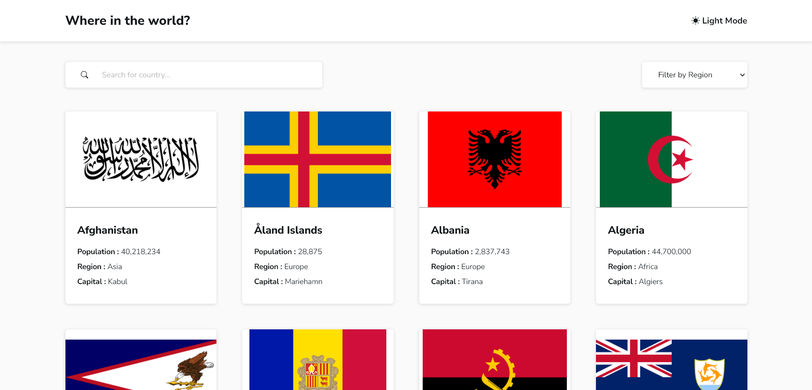
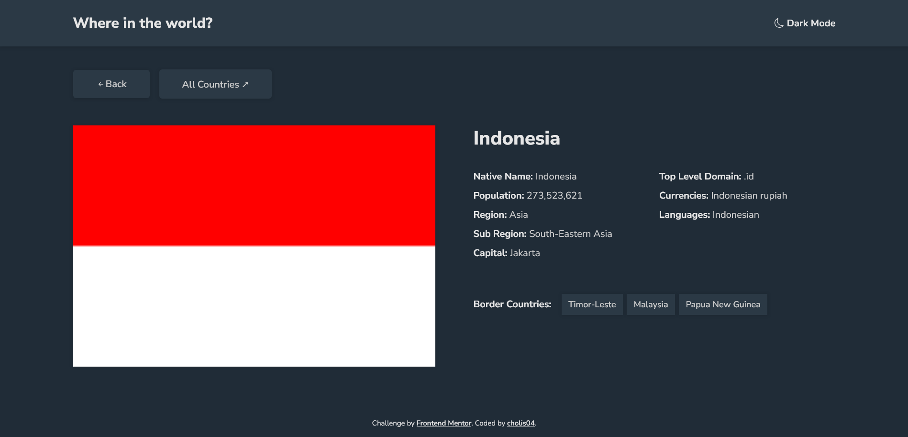

# Frontend Mentor - REST Countries API with color theme switcher solution

This is a solution to the [REST Countries API with color theme switcher challenge on Frontend Mentor](https://www.frontendmentor.io/challenges/rest-countries-api-with-color-theme-switcher-5cacc469fec04111f7b848ca). Frontend Mentor challenges help you improve your coding skills by building realistic projects.

## Table of contents

- [Overview](#overview)
  - [The challenge](#the-challenge)
  - [Screenshot](#screenshot)
  - [Links](#links)
- [My process](#my-process)
  - [Built with](#built-with)
  - [What I learned](#what-i-learned)
    - [Input Type Search](#input-type-search)
    - [Object Fit scale down](#object-fit-scale-down)
    - [Prefers Color Scheme](#prefers-color-scheme)
    - [Commas as Thousands Separators](#commas-as-thousands-separators)
  - [Continued development](#continued-development)
    - [Reset Region Filter Button](#reset-region-filter-button)
    - [Highlight Search Keywords](#highlight-search-keyword)
    - [Scroll Up Button](#scroll-up-button)
  - [Useful resources](#useful-resources)
- [Author](#author)
- [Acknowledgments](#acknowledgments)

## Overview

### The challenge

Users should be able to:

- See all countries from the API on the homepage
- Search for a country using an `input` field
- Filter countries by region
- Click on a country to see more detailed information on a separate page
- Click through to the border countries on the detail page
- Toggle the color scheme between light and dark mode _(optional)_

### Screenshot

Homepage - (Light)


Detail Country Page - (Dark)


### Link

- Live Site URL: [https://rest-countries-api-tan.vercel.app/](https://rest-countries-api-tan.vercel.app/)

## My process

### Built with

- Mobile-first workflow
- Semantic HTML5 markup
- CSS custom properties
- CSS Grid & Flexbox
- [React](https://reactjs.org/) - JS library
- [Next.js](https://nextjs.org/) - React framework
- [Styled Components](https://styled-components.com/) - For styles
- [Axios](https://axios-http.com/) - HTTP client
- [SWR](https://swr.vercel.app/) - React Hooks for Data Fetching
- [React Icons](https://react-icons.github.io/react-icons) - Icons

### What I learned

This project is very interesting. I learned new things that can be applied to complete this project well. Here are the details:

#### Input Type Search

Usually I will use `input` Tag with **text** type. But HTML has another type which is **search**. In this type, it will display an empty button (x) when we type something in it.

```html
<input
  type="search"
  id="country"
  name="country"
  aria-label="Name of Country"
  placeholder="Search for country..."
/>
```

#### Object Fit Scale Down

Displaying an Image in a container that has a fixed size is quite a tricky thing. Given also we need to adjust to the width of the screen to be responsive.

However, some images have different sizes, if you use `object-fit:cover;`, then there are some parts of the flag image that are not visible.

Therefore, I implemented `object-fit:scale-down`. thus displaying the image flag in **full** without being cropped and the height of the image container will be the same size.

```css
.flag-image {
  object-fit: scale-down;
  object-position: center;
}
```

#### Prefers Color Scheme

I just found out that some web browsers can detect theme colors on the device system.

This is very helpful for implementing color mode in web applications. In css, we can detect user's theme preference by using media query:

```css
@media (prefers-color-scheme: dark) {
  .dark {
    background-color: black;
    color: white;
  }
}
```

We can also detect if the user's web browser supports it or not.

```js
if (window.matchMedia('(prefers-color-scheme)').media !== 'not all') {
  var queryMedia = window.matchMedia('(prefers-color-scheme: dark)');
  if (queryMedia.matches) {
    setDark();
  } else {
    setLight();
  }
} else {
  setLight();
}
```

#### Commas as Thousands Separators

Returns numbers separated by commas. It can also help the user to know quickly what the number will be if the value is very large.

```js
const numberWithCommas = (x: number) => {
  return x.toString().replace(/\B(?=(\d{3})+(?!\d))/g, ',');
};
```

### Continued development

Use this section to outline areas that you want to continue focusing on in future projects. These could be concepts you're still not completely comfortable with or techniques you found useful that you want to refine and perfect.

#### Reset Region Filter Button

Use this section to recap over some of your major learnings while working through this project. Writing these out and providing code samples of areas you want to highlight is a great way to reinforce your own knowledge.

To see how you can add code snippets, see below:

```html
<h1>Some HTML code I'm proud of</h1>
```

```css
.proud-of-this-css {
  color: papayawhip;
}
```

```js
const proudOfThisFunc = () => {
  console.log('🎉');
};
```

#### Highlight Search Keywords

Use this section to recap over some of your major learnings while working through this project. Writing these out and providing code samples of areas you want to highlight is a great way to reinforce your own knowledge.

To see how you can add code snippets, see below:

```html
<h1>Some HTML code I'm proud of</h1>
```

```css
.proud-of-this-css {
  color: papayawhip;
}
```

```js
const proudOfThisFunc = () => {
  console.log('🎉');
};
```

#### Scroll Up Button

Use this section to recap over some of your major learnings while working through this project. Writing these out and providing code samples of areas you want to highlight is a great way to reinforce your own knowledge.

To see how you can add code snippets, see below:

```html
<h1>Some HTML code I'm proud of</h1>
```

```css
.proud-of-this-css {
  color: papayawhip;
}
```

```js
const proudOfThisFunc = () => {
  console.log('🎉');
};
```

### Useful resources

- [https://stackoverflow.com/questions/2901102/how-to-print-a-number-with-commas-as-thousands-separators-in-javascript](https://stackoverflow.com/questions/2901102/how-to-print-a-number-with-commas-as-thousands-separators-in-javascript)
- [https://dev.to/wh1zk1d/swr-dynamic-routes-in-next-js-3cbl](https://dev.to/wh1zk1d/swr-dynamic-routes-in-next-js-3cbl)
- [https://developer.mozilla.org/en-US/docs/Web/JavaScript/Reference/Global_Objects/String/replaceAll](https://developer.mozilla.org/en-US/docs/Web/JavaScript/Reference/Global_Objects/String/replaceAll)
- [https://www.kindacode.com/article/how-to-create-a-scroll-to-top-button-in-react/](https://www.kindacode.com/article/how-to-create-a-scroll-to-top-button-in-react/)
- [https://web.dev/prefers-color-scheme/](https://web.dev/prefers-color-scheme/)
- [https://sreetamdas.com/blog/the-perfect-dark-mode](https://sreetamdas.com/blog/the-perfect-dark-mode)

## Author

- Website - [https://cholis04.github.io](https://cholis04.github.io)
- Frontend Mentor - [@cholis04](https://www.frontendmentor.io/profile/cholis04)
- Dribbble - [cholis04](https://dribbble.com/cholis04)
- Instagram - [@cholis04](https://instagram.com/cholis04)
- Codepen - [cholis04](https://codepen.io/cholis04)

## Acknowledgments

Many thanks to anyone who provided feedback.
